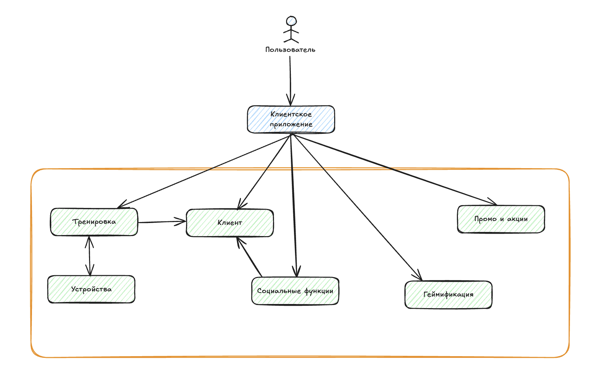

# Концептуальная архитектура проекта

> Система построена по модульному принципу с разделением ответственности по основным бизнес-функциям. Взаимодействие осуществляется через клиентское приложение.

## Описание схемы

### Компоненты
1. Пользователь  - конечный клиент. Взаимодействует с системной через приложение;
2. Клиентское приложение - основной интерфейс;
3. Клиент - модуль отвечает за профиль пользователя, его настройки, клиентские данные;
4. Тренировка - модуль управляет сессиями тренировок. Предназначен для хранения результатов, маршруты, времени и прогресса;
5. Инвентарь содержит сведения о спортивном снаряжении пользователя. Используется для рекомендаций и анализа;
6. Социальные функции один из самых важных компонентов системы. Предназначен для формирования групп по интересам и взаимодействия между участниками;
7. Геймификация реализует механизмы челленджей, достижений и прогресса для увеличения вовлеченности;
8. Промо и акции отвечает за отображение персонализированных предложений и новостей.
