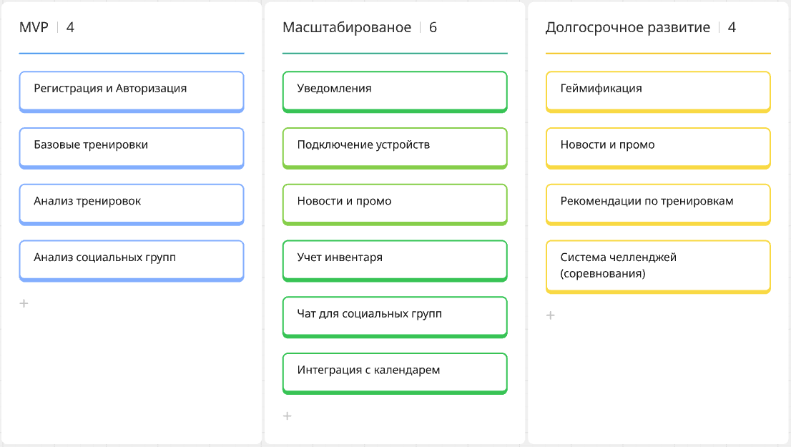

# План поэтапной разработки и расширения системы

## План разработки

> На схеме ниже представлена поэтапная реализация продукта с делением на три фазы: MVP, масштабирование и долгосрочное развитие.
> - MVP покроет основные потребности бизнеса, и поможет проверить гепотезы;
> - Масштабирование расширит возможности;
> - Долгосрочное развитие делает продукт привлекательнее и привлечет большее количество пользователей.

## Анализ критически важных компонентов

> Для успешной реализации системы были выделены следующие критически важные компоненты, от качества и стабильности которых зависит работа ключевых функций
 
1. Компонент «Тренировки»
Это основной функциональный блок приложения. Он отвечает за создание, хранение, отображение и анализ тренировочных сессий.
Компонент критичен, потому что напрямую влияет на пользовательскую ценность продукта.
Основной риск связан с точностью данных: при сбоях в сборе метрик или ошибках анализа пользователь может поотерять доверие к системе.

3. Компонент «Социальные группы»
Обеспечивает создание групп, отображение активности друзей, обмен сообщениями и челленджи.
Критичен с точки зрения вовлечения и удержания.
Сложности возникают с нагрузкой при масштабировании, так как чаты и уведомления требуют устойчивости системы.

4. Компонент «Геймификация»
Механизмы достижений, очков, сравнений, рейтингов.
Повышает мотивацию и влияет на удержание.
Проблемы могут быть в синхронности данных при участии в групповых активностях.

5. Компонент «Интеграции с устройствами»
Отвечает за получение данных с трекеров, датчиков и умных часов.
Без него невозможно реализовать анализ тренировок.
Критичность в том, что даже кратковременные сбои могут лишить пользователя важной информации. Нужно поддерживать совместимость с популярными API, реализовать fallback-сценарии и логирование ошибок.
